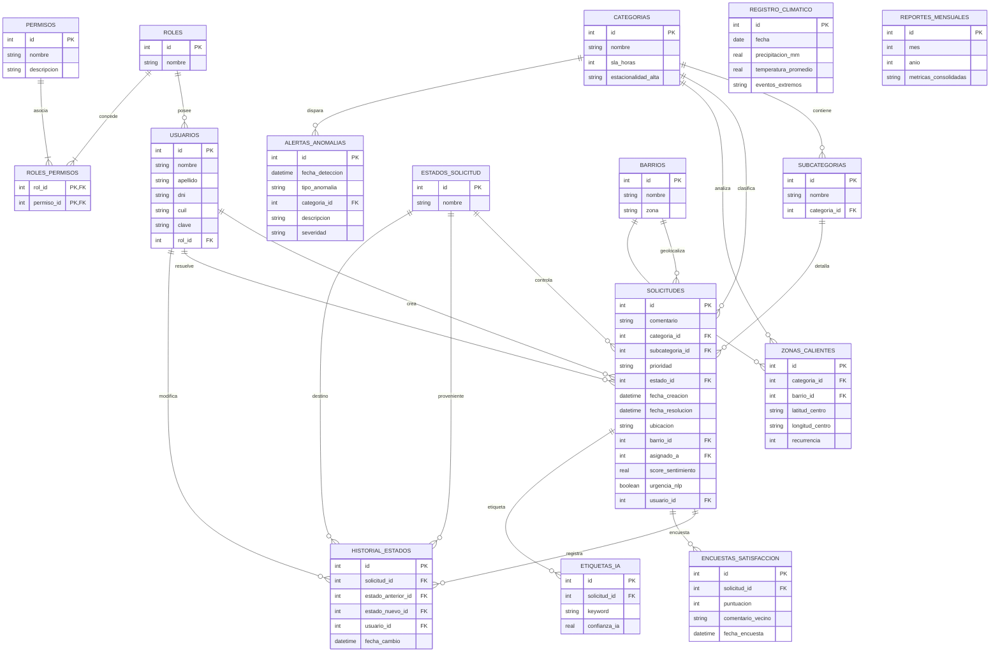

# 🌱 Modelo de Entidad-Relación - Ecosistema RuralConecta AI

Este documento detalla la estructura lógica de la base de datos (`ruralconecta.db`) del ecosistema **RuralConecta AI**. Contiene un diagrama interactivo en formato **Mermaid** y el diccionario de datos de las 16 tablas operativas y analíticas del sistema.

---

## 📊 Diagrama de Entidad-Relación (MER)

---

## 📖 Diccionario de Datos

### 1. Tablas de Seguridad y Usuarios

#### `roles`
Almacena los perfiles de acceso autorizados del sistema.
* **`id` (INTEGER, PK)**: Identificador único autoincremental.
* **`nombre` (TEXT)**: Nombre del rol (ej: `Vecino`, `De Gestión`).

#### `permisos`
Catálogo de acciones y accesos autorizados.
* **`id` (INTEGER, PK)**: Identificador único autoincremental.
* **`nombre` (TEXT, UNIQUE)**: Código único del permiso (ej: `VER_HISTORIAL_RECLAMOS`).
* **`descripcion` (TEXT)**: Propósito del permiso de seguridad.

#### `roles_permisos`
Tabla puente de muchos-a-muchos que asocia privilegios a los roles.
* **`rol_id` (INTEGER, PK, FK)**: Referencia a la tabla `roles`.
* **`permiso_id` (INTEGER, PK, FK)**: Referencia a la tabla `permisos`.

#### `usuarios`
Cuentas de acceso de ciudadanos (vecinos) y operadores (gestores/analistas).
* **`id` (INTEGER, PK)**: Identificador único autoincremental.
* **`nombre` (TEXT)**: Nombre de pila del usuario.
* **`apellido` (TEXT)**: Apellido del usuario.
* **`dni` (TEXT, UNIQUE)**: Documento Nacional de Identidad (sin puntos).
* **`cuil` (TEXT, UNIQUE)**: Código Único de Identificación Laboral (sin guiones).
* **`clave` (TEXT)**: Contraseña almacenada en hash seguro (SHA-256).
* **`rol_id` (INTEGER, FK)**: Rol asignado al usuario (referencia a `roles`).

---

### 2. Tablas de Estructura de Reclamos

#### `categorias`
Tipos principales de incidentes y requerimientos del medio rural.
* **`id` (INTEGER, PK)**: Identificador único autoincremental.
* **`nombre` (TEXT)**: Nombre de la categoría (ej: `Alumbrado`, `Calles`).
* **`sla_horas` (INTEGER)**: Tiempo límite máximo de resolución (SLA) en horas.
* **`estacionalidad_alta` (TEXT)**: Época del año de alta demanda (ej: `VERANO`, `OTOÑO`).

#### `subcategorias`
Desglose técnico de problemáticas específicas asociadas a una categoría.
* **`id` (INTEGER, PK)**: Identificador único autoincremental.
* **`nombre` (TEXT)**: Detalle del incidente (ej: `Luminaria no funciona`).
* **`categoria_id` (INTEGER, FK)**: Categoría a la que pertenece (referencia a `categorias`).

#### `estados_solicitud`
Etapas del ciclo de vida de una solicitud.
* **`id` (INTEGER, PK)**: Identificador único autoincremental.
* **`nombre` (TEXT)**: Nombre de la etapa (ej: `PENDIENTE`, `EN REVISION`, `EN PROCESO`, `RESUELTO`, `RECHAZADO`).

#### `barrios`
Delimitación geográfica de los parajes y sectores rurales.
* **`id` (INTEGER, PK)**: Identificador único autoincremental.
* **`nombre` (TEXT)**: Nombre oficial del paraje rural.
* **`zona` (TEXT)**: Sector o zona del paraje (ej: `Centro`, `Norte`, `Sur`, `Este`, `Oeste`).

---

### 3. Tabla Principal y Trazabilidad

#### `solicitudes`
Registro central de todas las solicitudes e incidentes del medio rural.
* **`id` (INTEGER, PK)**: Identificador único (Nro de Gestión).
* **`comentario` (TEXT)**: Descripción textual provista por el ciudadano.
* **`categoria_id` (INTEGER, FK)**: Categoría asignada (referencia a `categorias`).
* **`subcategoria_id` (INTEGER, FK)**: Subcategoría asignada (referencia a `subcategorias`).
* **`prioridad` (TEXT)**: Urgencia operativa (`ALTA`, `MEDIA`, `BAJA`).
* **`estado_id` (INTEGER, FK)**: Estado actual del caso (referencia a `estados_solicitud`).
* **`fecha_creacion` (DATETIME)**: Fecha y hora de ingreso.
* **`fecha_resolucion` (DATETIME)**: Fecha y hora de cierre.
* **`ubicacion` (TEXT)**: Dirección exacta o coordenadas.
* **`barrio_id` (INTEGER, FK)**: Paraje asociado (referencia a `barrios`).
* **`asignado_a` (INTEGER, FK)**: Operador gestor a cargo (referencia a `usuarios`).
* **`score_sentimiento` (REAL)**: Nivel de malestar de 0 a 1 obtenido por NLP.
* **`urgencia_nlp` (BOOLEAN)**: Flag de emergencia inminente obtenido por NLP.
* **`usuario_id` (INTEGER, FK)**: Ciudadano solicitante que inició el caso (referencia a `usuarios`).

#### `historial_estados`
Bitácora de auditoría inmutable que registra cada transición de estado de una solicitud.
* **`id` (INTEGER, PK)**: Identificador único autoincremental.
* **`solicitud_id` (INTEGER, FK)**: Caso modificado (referencia a `solicitudes`).
* **`estado_anterior_id` (INTEGER, FK)**: Estado de origen (referencia a `estados_solicitud`).
* **`estado_nuevo_id` (INTEGER, FK)**: Estado de destino (referencia a `estados_solicitud`).
* **`usuario_id` (INTEGER, FK)**: Operador responsable del cambio (referencia a `usuarios`).
* **`fecha_cambio` (DATETIME)**: Marca de tiempo de la transición.

---

### 4. Tablas Analíticas y de Inteligencia Artificial

#### `alertas_anomalias`
Incidentes inusuales o picos atípicos detectados por modelos analíticos.
* **`id` (INTEGER, PK)**: Identificador único autoincremental.
* **`fecha_deteccion` (DATETIME)**: Fecha y hora de detección del pico de carga.
* **`tipo_anomalia` (TEXT)**: Descripción de la anomalía técnica.
* **`categoria_id` (INTEGER, FK)**: Categoría donde ocurrió el pico (referencia a `categorias`).
* **`descripcion` (TEXT)**: Detalle del incidente.
* **`severidad` (TEXT)**: Nivel de riesgo (`CRITICO`, `ALTO`, `MEDIO`).

#### `encuestas_satisfaccion`
Feedback del ciudadano recolectado tras la resolución del caso.
* **`id` (INTEGER, PK)**: Identificador único autoincremental.
* **`solicitud_id` (INTEGER, FK)**: Caso calificado (referencia a `solicitudes`).
* **`puntuacion` (INTEGER)**: Calificación del servicio (ej: 1 a 5 estrellas).
* **`comentario_vecino` (TEXT)**: Opinión libre del ciudadano.
* **`fecha_encuesta` (DATETIME)**: Fecha de registro del feedback.

#### `etiquetas_ia`
Keywords relevantes extraídas del comentario del ciudadano usando NLP.
* **`id` (INTEGER, PK)**: Identificador único autoincremental.
* **`solicitud_id` (INTEGER, FK)**: Caso origen (referencia a `solicitudes`).
* **`keyword` (TEXT)**: Palabra clave o concepto técnico identificado.
* **`confianza_ia` (REAL)**: Nivel de certeza de la extracción (de 0 a 1).

#### `zonas_calientes`
Geolocalización agregada de áreas con alta densidad y recurrencia de incidentes.
* **`id` (INTEGER, PK)**: Identificador único autoincremental.
* **`categoria_id` (INTEGER, FK)**: Categoría del foco (referencia a `categorias`).
* **`barrio_id` (INTEGER, FK)**: Paraje del foco (referencia a `barrios`).
* **`latitud_centro` (TEXT)**: Coordenada de latitud del baricentro.
* **`longitud_centro` (TEXT)**: Coordenada de longitud del baricentro.
* **`recurrencia` (INTEGER)**: Cantidad de casos acumulados en el cuadrante.

#### `registro_climatico`
Datos de contexto meteorológico para cruce estadístico estacional.
* **`id` (INTEGER, PK)**: Identificador único autoincremental.
* **`fecha` (DATE)**: Día registrado.
* **`precipitacion_mm` (REAL)**: Milímetros de lluvia caídos (relevante para calles e inundaciones).
* **`temperatura_promedio` (REAL)**: Temperatura media en °C (relevante para terrenos y basura).
* **`eventos_extremos` (TEXT)**: Descripción de tormentas, viento o granizo.

#### `reportes_mensuales`
Reportes históricos consolidados mensualmente para auditoría de alto nivel directivo.
* **`id` (INTEGER, PK)**: Identificador único autoincremental.
* **`mes` (INTEGER)**: Mes calendario (1 al 12).
* **`anio` (INTEGER)**: Año calendario.
* **`metricas_consolidadas` (TEXT)**: JSON estructurado con KPIs cerrados del período.
