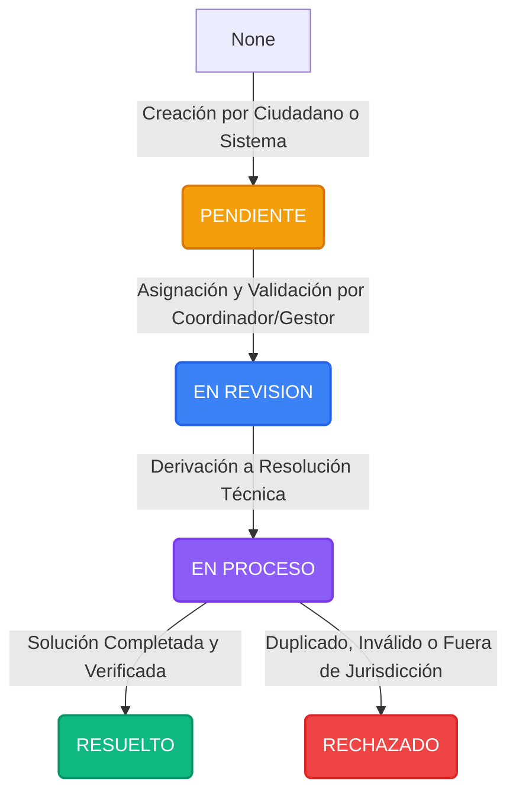

# 🌱 Manual de Usuario: Panel de Auditoría y Trazabilidad
## **RuralConecta AI**

Este manual proporciona una guía detallada para el uso, interpretación y administración del **Panel de Auditoría y Trazabilidad de Flujo** dentro del ecosistema **RuralConecta AI**. 

El panel está diseñado para administradores, coordinadores de servicios y gestores del medio rural que necesitan supervisar la eficiencia operativa, identificar cuellos de botella y garantizar el cumplimiento de los Niveles de Acuerdo de Servicio (SLA, por sus siglas en inglés) establecidos para cada categoría de solicitud.

---

## 📌 1. Introducción al Módulo de Auditoría

El módulo de auditoría es la herramienta analítica central para la toma de decisiones en el medio rural. Registra automáticamente cada cambio de estado en la vida de una solicitud de los ciudadanos, permitiendo:
1. **Monitorear** los tiempos de respuesta y resolución en tiempo real.
2. **Identificar** en qué áreas o distritos se acumulan retrasos (cuellos de botella).
3. **Auditar** de forma forense la historia completa de transiciones de cualquier expediente.
4. **Evaluar** el desempeño de los gestores y cuadrillas de servicio.
5. **Prevenir** el vencimiento de compromisos con los ciudadanos rurales a través de alertas proactivas.

---

## 📊 2. Indicadores Clave de Rendimiento (KPIs)

En la parte superior del Panel de Auditoría se presentan cinco métricas clave acumuladas. Su comprensión es vital para evaluar la salud general de la gestión de solicitudes:

| Métrica | Descripción | Fórmula / Cálculo |
| :--- | :--- | :--- |
| **Total Solicitudes** | Volumen histórico acumulado de solicitudes ingresadas en el sistema. | Conteo total de filas en la tabla `solicitudes`. |
| **Resueltas / Cerradas** | Cantidad de casos que han finalizado su ciclo operativo. | Solicitudes en estado `RESUELTO` o `RECHAZADO`. |
| **Promedio Resolución** | Tiempo medio que toma cerrar un caso desde su ingreso. | Diferencia en horas entre `fecha_resolucion` y `fecha_creacion` para solicitudes cerradas. |
| **Cumplimiento SLA** | Porcentaje de solicitudes cerradas dentro de los plazos establecidos. | `(Cerrados a Tiempo / Total Cerrados con SLA) * 100`. |
| **Alertas SLA** | Casos activos (abiertos) que ya superaron su límite de tiempo. | Solicitudes abiertas donde el tiempo transcurrido es mayor al `sla_horas` de su categoría. |

---

## 🛠️ 3. Reportes y Acciones Disponibles

El panel cuenta con un selector de reportes analíticos y herramientas de prueba. A continuación, se detalla el funcionamiento de cada una de las 7 opciones disponibles:

### 1. Reporte de Desempeño por Categoría
* **Objetivo:** Identificar qué tipo de problemas en parajes presentan mejor o peor tiempo de respuesta.
* **Información Visualizada:**
  * **Categoría:** Nombre de la tipología de la solicitud (ej: Caminos Rurales, Abastecimiento de Agua, Alumbrado Rural).
  * **SLA (Horas):** Tiempo máximo comprometido por el servicio para resolver esa categoría.
  * **Total:** Volumen total de solicitudes generadas para esa categoría.
  * **Resueltos:** Volumen de casos finalizados para esa categoría.
  * **Promedio Resolución (Horas):** El tiempo real de respuesta promedio para esa categoría.
  * **Cumplimiento SLA:** Porcentaje de efectividad en el cumplimiento del tiempo límite de esa categoría.
  * **Vencidos Activos:** Cantidad de solicitudes de esa categoría que se encuentran actualmente abiertas y retrasadas.

### 2. Análisis de Cuellos de Botella (Dwell Times)
* **Objetivo:** Medir el tiempo neto que los expedientes permanecen en espera en cada estado operativo.
* **Estados Medidos:**
  * `PENDIENTE`: Tiempo desde que el ciudadano rural ingresa el caso hasta que un coordinador realiza la primera revisión de validez.
  * `EN REVISION`: Tiempo que pasa la solicitud en análisis inicial, validación de datos o derivación.
  * `EN PROCESO`: Tiempo de ejecución técnica en el terreno por parte de las cuadrillas de servicio.
  * `RESUELTO` / `RECHAZADO`: Estados de cierre final (archivos).
* **Interpretación:** Si la permanencia promedio en `PENDIENTE` es alta, el cuello de botella está en el filtrado inicial. Si es alta en `EN PROCESO`, reside en la capacidad operativa de los equipos en el territorio.

### 3. Trazabilidad Cronológica de un Caso
* **Objetivo:** Realizar una auditoría forense individualizada de un caso mediante su identificador numérico (ID).
* **Funcionamiento:** Ingrese el ID de la solicitud (ej: `105`) para desplegar su ficha de identidad completa:
  * **Metadatos generales:** Quién reportó, prioridad, categoría, estado actual, gestor asignado y fechas.
  * **Cronología de auditoría:** Historial detallado paso a paso indicando fecha y hora exacta del cambio, estado anterior, estado nuevo, y el nombre y rol de la persona que autorizó la acción (o si fue realizado de forma automática por el `Sistema`).
  * **Tiempos netos:** Muestra el tiempo total transcurrido si está cerrado o el tiempo de actividad en bandeja si continúa abierto.

### 4. Alertas de Desviación y SLA Excedido
* **Objetivo:** Concentrar en una sola lista priorizada todos los casos críticos que requieren atención inmediata por retraso.
* **Priorización:** Las alertas se ordenan jerárquicamente primero por **Prioridad** (`ALTA` -> `MEDIA` -> `BAJA`) y luego por la magnitud del **Retraso** (mayor tiempo excedido primero).
* **Campos claves:** ID del caso, categoría, estado actual, límite estipulado por SLA, tiempo excedido acumulado (en días y horas) y gestor responsable para facilitar el seguimiento.

### 5. Reporte de Desempeño de Gestores
* **Objetivo:** Monitorear la productividad, carga laboral y eficiencia de resolución de cada operador o gestor asignado en el medio rural.
* **Métricas por Gestor:**
  * **Activos:** Cantidad de expedientes abiertos actualmente bajo su responsabilidad.
  * **Resueltos:** Número de casos cerrados exitosamente por su gestión.
  * **Prom. Resol (h):** Tiempo medio de resolución en sus casos cerrados.
  * **SLA Cumplim.:** Porcentaje de casos cerrados dentro del límite de tiempo por este gestor.

### 6. Simular/Resetear Historial de Auditoría (Testing)
* **Objetivo:** Generar una base de datos consistente de prueba para validar el comportamiento analítico del panel.
* **Funcionamiento:** Elimina el historial previo en la tabla `historial_estados` y genera de manera consistente un conjunto de transiciones lógicas (pendientes, en revisión, en proceso, resoluciones) para las solicitudes existentes utilizando parámetros temporales aleatorios coherentes. 
* > [!WARNING]
  > Esta acción altera el historial de transiciones registrado en la base de datos local y debe usarse únicamente en entornos de prueba o durante la demostración/validación inicial del software.

### 7. Visualización Gráfica de Métricas
* **Objetivo:** Ofrecer una visión ejecutiva mediante gráficos interactivos integrados en Streamlit.
* **Componentes Gráficos:**
  * Volumen de Solicitudes por Categoría.
  * Volumen de Solicitudes por Paraje.
  * Estado general de las Solicitudes (Distribución actual).
  * Distribución de Prioridades de los Casos en el sistema.

---

## 🔄 4. Ciclo de Vida de los Estados y Registro de Auditoría

El flujo operativo estándar de un caso sigue un modelo secuencial de control, donde cada cambio es guardado en la tabla `historial_estados` para su posterior auditoría:

### Roles involucrados en el Registro de Auditoría:
1. **Ciudadano Rural (Rol ID 1):** Registra el ingreso original del caso en estado `PENDIENTE`.
2. **Gestor (Rol ID 2):** Realiza la gestión de estados, derivando a revisión, en proceso, o dictaminando la resolución.
3. **Coordinador / Administrador (Rol ID 3):** Monitorea indicadores globales y reasigna tareas de servicio.
4. **Sistema (Automático):** Genera transiciones automáticas en simulaciones o cuando fallan triggers.

---

## 📈 5. Fórmulas de Tiempos de Servicio (SLA)

El cálculo del límite de tiempo se basa en la tabla `categorias`. Cada categoría tiene definido un campo `sla_horas` (ej: Caminos Rurales = 72 horas, Alumbrado Rural = 48 horas, Saneamiento = 48 horas). 

### Fórmulas del Sistema:
* **Tiempo de Resolución Real ($T_R$):**
  $$T_R = \text{FechaResolucion} - \text{FechaCreacion}$$
* **Desviación o Retraso de SLA ($D_{SLA}$) para casos abiertos:**
  $$D_{SLA} = (\text{FechaActual} - \text{FechaCreacion}) - \text{SLAHoras}$$
  *(Si $D_{SLA} > 0$, la solicitud se clasifica automáticamente como "Alerta SLA Vencida")*.

---

## 💡 6. Buenas Prácticas para Coordinadores

* **Monitoreo Diario de Alertas SLA:** El coordinador general debe iniciar el día revisando el **Reporte 4 (Alertas de Desviación)** para redistribuir la carga de los gestores que tengan casos demorados.
* **Control de Cuellos de Botella Semanal:** Observe el **Reporte 2** con frecuencia semanal. Si el promedio de permanencia en `EN REVISION` aumenta significativamente, indica que los gestores están demorando demasiado tiempo en validar o derivar los casos.
* **Auditoría Forense ante Reclamaciones:** Si un ciudadano realiza una queja por la demora de un servicio, use el **Reporte 3 (Trazabilidad)** para ver exactamente qué gestores manejaron el expediente y en qué fecha se produjeron las demoras o actualizaciones.

---
*RuralConecta AI - Módulo de Auditoría y Control de Gestión Rural. Provincia de La Rioja - "Conectando Parajes, Cultivando Comunidad".*
